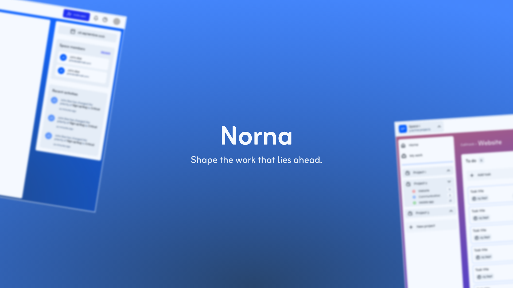

  

<h3 align="center">Norna</h3>

🚧 Norna is currently under development.

---

Norna is a modern project management application designed to help individuals and small teams organize their work.

Inspired by tools like Jira and Kanban-based project management, Norna allows users to create Spaces, organize them into Boards, and manage tasks through customizable columns.

## 📝 Table of Contents
- [Problem Statement](#problem_statement)
- [Idea / Solution](#idea)
- [Dependencies / Limitations](#limitations)
- [Authors](#authors)

## 🧐 Problem Statement 
I have used a lot of project management tools, but they often feel too complex or too expensive for simple projects and small teams.

When I was a student, I used a project management tool through a student license, but I quickly reached its limitations.

I found the same problem with many tools: on one side, they can be too expensive for small projects or teams, and on the other side, they sometimes lack the features I need.

Norna was created to find a balance between simplicity, useful features, and affordability.

## 💡 Idea / Solution 
Norna is a project management and collaboration tool.

To explain the name, it is inspired by the Norns, figures from Norse mythology associated with shaping fate and the course of events.

It can be used for small or large projects, as well as by independent workers or small teams.

Each account can have several Spaces, and each Space has its own team. This allows you to decide who you want to work with on each board.

Do you want a Space for school with your student team? You can.
Do you want a Space for your personal projects with only you? You can.

Each board also contains tasks that can be assigned to one or more people and given a due date, making it easier for users to organize their work and collaborate.

## ⛓️ Limitations 
Some features that Norna will not have at the beginning:

1. Users will need an account on the platform before they can be invited by other users.
2. Users will not receive email reminders for assigned tasks.
3. There will be no integrations with GitHub, GitLab, or other platforms.
4. Users will not have different roles. If someone is invited to a Space, they will have access to all Boards within it.
5. Changes made by another user may not appear immediately and may require a page refresh.

The first version will remain simple, as I want to make sure that all the core functionality is stable before adding more advanced features.

## ✍️ Authors 
- [@MaelRoulette](https://github.com/Mael-Roulette) - [contact@mael-roulette.fr](mailto:contact@mael-roulette.fr)
